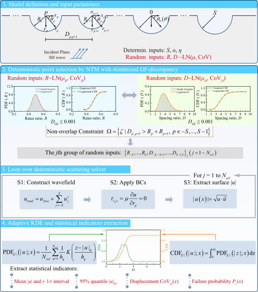

# multi-canyon-NTM‑KDE
[](https://opensource.org/licenses/MIT)

### What is this repository for?

The demo code for "Stochastic Analysis of SH-Wave Scattering by Multiple Semicircular Canyons with Random Geometric Parameters"

The code performs stochastic analysis of surface ground motion for a group of semi‑circular canyons under SH‑wave incidence, accounting for the uncertainty in canyon geometry—namely, the random variability of individual canyon radii and of the spacings between adjacent canyons. By coupling **number‑theoretic point selection**, a **deterministic wave‑function expansion solver**, and **adaptive kernel density estimation**, it efficiently yields the probability density function (PDF), cumulative distribution function (CDF), and statistical descriptors (mean, 95th percentile, coefficient of variation, failure probability) of the surface displacement amplitude.

  
*Figure 1: Overall analysis framework coupling stochastic simulation with a deterministic scattering solver.*

### Requirements
- MATLAB R2019b or later (tested on R2022a)
- Statistics and Machine Learning Toolbox (required for `sobolset`)

### Repository Structure

valley-group-pdem/
├── README.md
├── LICENSE
├── MAIN_ANALYSIS.m                       # Master script for all parametric analyses
├── core/
│ ├── func_pdem.m                         # Core stochastic analysis routine
│ ├── generate_canyon_samples.m           # Initial sample generation (Sobol + geometric filter)
│ ├── post_optimize_samples.m             # Iterative rearrangement under constraints (minimize GF‑discrepancy)
│ ├── compute_GF_discrepancy.m            # Compute generalized F‑discrepancy
│ ├── check_overlap.m                     # Non‑overlap geometric compatibility check
│ ├── compute_displacement_vector3.m      # Deterministic solver for 3 canyons
│ └── compute_displacement_vectorN.m      # Deterministic solver for arbitrary number of canyons
├── results/
│ └── ParamAnalysis_Angle/                # Example output folder (incident angle analysis)
└── (other result folders are generated automatically when running MAIN_ANALYSIS.m)

### Installation
1. Clone the repository:
   ```bash
   git clone https://github.com/Frank-liang-duan/multi-canyon-NTM-KDE.git
